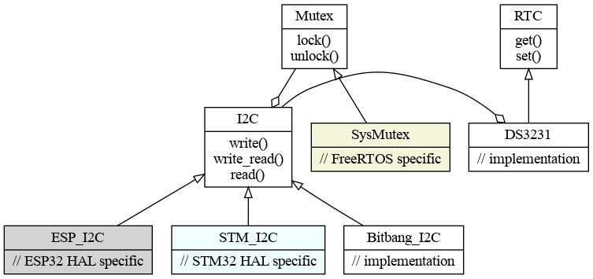

# Panglos - Real-time OS framework

Panglos is a set of C++ classes 
designed to be used as a framework to build real-time applications around.

Panglos has been used as a template for a successful commercial project. 
The techniques used in Panglos were ported to both STM32 and RISC-V targets.
Code could be compiled and run on either target interchangably and unit and system tested on Linux.

The source is available on [github](https://github.com/DaveBerkeley/panglos).

The aim is to remove all the low level OS and HAL calls from the application code.
Ideally application code should not 
include any hardware specific or OS specfic code.
Doing this allows you to write code that can be tested on your PC instead of the target system. This gives you access to excellent tools like 
['valgrind'](https://valgrind.org/) or the thread sanitizer capabilities of __clang__. Compiling the code with multiple compilers also gives you better compile time checking. __gcc__ and __clang__ have different strengths and weakneses.

The intention is to abstract the underlying processor and OS specific code away 
and provide a clean, simple C++ interface.
The core code is intended to be simple, elegant, easy to use, easy to test and easy to read.

If the code is littered with HAL and [FreeRTOS][1] calls, it is harder to write unit tests.
By making a simple C++ abstract layer, which can be easily stubbed or mocked,
it becomes possible to use TDD for almost all of the application code.

You can also run the unit tests on the target, for better coverage.

It is written as a wrapper around [FreeRTOS][1] 
and the STM32 and ESP32 HALs. My focus is now on the ESP32.

The name @ref panglos is taken from the character Dr. Pangloss in Voltaire's satirical book ['Candide'](https://en.wikipedia.org/wiki/Candide).
It is intended as a warning about boundless optimism.
Optimism in the face of evidence to the contrary is dangerous in software development.
I have seen it kill projects and companies.
It is not __The best of all possible worlds__. It's not even close.

----
OS Abstraction
====

There are a number of OS related classes used to absract the underlying RTOS - so far only FreeRTOS is supported on the target, but it is trivial to add others. Linux is supported for test.

Mutex
====

The class panglos::Mutex provides mutex support. In [FreeRTOS][1] there are 
different mutex functions for use in interrupts and tasks. These are hidden by the Mutex class.
There are different sorts of Mutex. 
A task mutex is currently implemented by disabling the scheduler.
This prevents the task being scheduled out by another task.
An interrupt mutex is for use when one of the execution threads is an interrupt.
This is implemented using a critical section.
A recurcise Mutex is sometimes needed when the same task can have nexted locks on a mutex.
You need to know which to use, which depends on the application. 
eg. panglos::Mutex::create(Mutex::RECURSIVE) 

The class panglos::Lock is used as a simple way of locking / unlocking the mutex
automatically.

    void function()
    {
        Lock lock(mutex);

        ... code protected by Mutex
    }

This works even if the mutex is null (it does nothing).
It doesn't care if it is a critical section or a task lock.
All my mutexes work like this. See mutex.h.

Thread
====

The Thread class allows the management of threads in an OS agnostic way.

Queue
====

The Queue class is a convenient way to communicate between threads, or between interrupt handlers and threads.

Semaphore
====

The Semephore class wraps the underlying RTOS semaphore.

----

Hardware Abstraction
====

Hardware devices should be wrapped by abstract base classes. This allows you to test the calling code without having to run on the target.

There are base classes for eg. GPIO, SPI, I2C, UART, DAC and ADC devices.
These will have target / hardware specific implementations which make real HAL calls,
but the application code can use the high level API.

This allows you to develop higher level drivers, which get passed the IO devices. For example, the DS3231 is an I2C RTC. It has is passed an I2C device in its ctor. It implements an RTC interface. There is no RTOS or HAL code in the implementation. So the same driver can be run on any hardware. The application code doesn't care which RTC chip is used.

The diagram shows how the classes interrelate. The init code in main is the only
part of the applicaton that deals with real target issues. It creates a Mutex, a SPI interface,
and a DS3231 RTC object. The SPI class doesn't need to have any OS/HAL dependencies. It uses the Mutex to lock the SPI resource. The DS3231 doesn't have any OS/HAL dependencies. All it needs is the SPI object. The application code just needs the RTC object.

----

Linked Lists
===

The single linked list code (@ref list.cpp) is from a C project I wrote a while ago. 
It has the advantage over the std::list<> class; it does not have to use any dynamic memory allocation.
List items can be a mix of static, automatic, dynamic, it doesn't matter. Items can be in multiple
lists at the same time, as they can have multiple 'next' pointers.

The trick is to provide a function for the object that returns the address of the 'next' pointer.
You need to implement this function for each object type. You pass the function into the List<> constructor. The list functions then use it to traverse the list. If you have more than one 'next' pointer, you can provide
a different function for each pointer.
This allows the same object to potentially be in multiple lists.

    class Thing {
        Thing *next;
        Thing *other;
        int stuff;
    public:
        static Thing **get_next(Thing *thing) { return & thing->next; }
        static Thing **get_other(Thing *thing) { return & thing->other; }
    };

    List<Thing*> things(Thing::get_next);
    List<Thing*> other_things(Thing::get_other);

    ...

    // Add an object to both lists
    Thing *thing = new Thing;
    things.append(thing, mutex);
    other_things.push(thing, mutex);

The advantage of passing the Mutex to the list functions is that it can be used to lock multiple list functions. eg. moving an item from one list to the other :

    void fn(int value)
    {
        Lock lock(mutex);

        // the lists are both locked, so you don't need to pass mutex to the list calls
        Thing *thing = things.find(match_fn, & value, 0);
        if (thing)
        {
            other_things.push(thing, 0);
        }
    }

----

Tracing / IO
====

I originally wrote my own printf primitives, but later used an available 
[printf](https://github.com/eyalroz/printf) library on GitHub.

Tracing / logging is really important during development and for diagnostics / monitoring.

        PO_DEBUG("dir=%d speed=%f", wind.direction, wind.speed);

I've seen lots of different approaches to logging in my career. I have tried to make it as easy to use as possible. It uses a simple ___printf()___ style of formatting. It prints the time (as a tick), the thread name, the severity is 
the same as [syslog](https://en.wikipedia.org/wiki/Syslog) severity levels.
Then it prints the file name, line number and function name, followed by any passed parameters. eg:

    8570648 main DEBUG src/targets/esp32_c3_supermini.cpp +188 on_weather() : dir=296 speed=5.810000

There is a Logger class that allows one or more logging targets to be specified, so logging can be sent to eg. a UART and a network interface.

The path / line number are formatted so that you can cut and paste the line onto the command line and run an editor, eg gvim, with the details and it will open the editor on the offending line.

----

work in progress ...

[1]: https://www.freertos.org/        "FreeRTOS"
